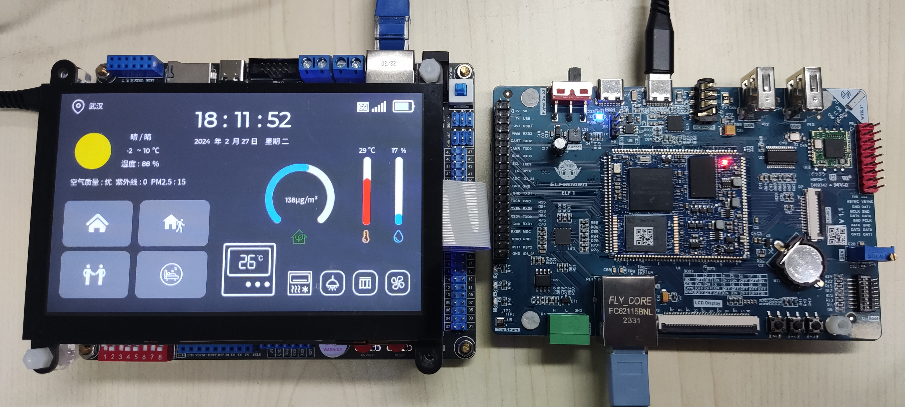

# 基于 Linux 的智能家居系统

基于 [正点原子 IMX6U 开发板](https://www.alientek.com/productinfo/1333119.html) 和 [ElfBoard ELF 1 开发板](https://www.elfboard.com/product/37.html) 完成。



## 项目简介

[哔哩哔哩视频链接](https://www.bilibili.com/video/BV1Bt421t7eN)

IMX6U 开发板模拟智能家居中的主控面板，UI 设计采用开源的 LVGL，实时刷新显示时间、天气、室内空气质量、温湿度等信息，实现对家居设备电灯、窗帘、通风扇的控制，天气数据来自于[心知天气](https://www.seniverse.com/)，使用 [cJSON](https://github.com/DaveGamble/cJSON) 对天气数据进行解析。

ELF 1 开发板模拟终端设备，三个 LED 分别代表电灯、窗帘、通风扇，电位器（ADC）模拟室内空气质量检测器，温湿度传感器则用来检测环境中的温湿度。

关于 ELF 1 开发板的详细介绍可以阅读 [ELF 1 开箱初体验](https://blog.csdn.net/weixin_44550536/article/details/135173850)。

IMX6U 和 ELF 1 两者通过以太网实现数据交互，均基于 Linux 系统开发，两个开发板的资源使用情况总体如下所示：

- IMX6U 开发板：5inch RGB 800×480 显示屏、以太网口
- ELF 1 开发板：3 个 LED、电位器（ADC）、温湿度传感器、以太网口

## 仓库简介

本仓库开源了 IMX6U 的工程源码，它以 LVGL 的 Linux 移植工程 lvgl_demo 为基础。

工程源码结构如下所示：

```
lvgl_demo
├── app                # 应用源码
|    ├── cJSON         # cJSON 解析器
|    ├── protocol      # 自定义通信协议
|    ├── socket        # socket 源码
|    ├── application.c # 主要应用
|    ├── button.c      # 按键应用
|    ├── def.h         # 一些定义
|    └── weather.c     # 天气应用
├── lv_drivers         # LVGL 驱动源码
├── lvgl               # LVGL 源码
├── ui                 # UI 设计源码
├── lv_conf.h          # LVGL 库配置文件
├── lv_drv_conf.h      # LVGL 驱动配置文件
├── main.c             # main.c 文件
├── Makefile           # Makefile 文件
└── README.md          # README 文件
```

关于 LVGL 的 Linux 移植可以参考阅读 [嵌入式 Linux 下的 LVGL 移植](https://blog.csdn.net/weixin_44550536/article/details/131714105)。

关于 UI 设计可以参考阅读 [基于 LVGL 使用 SquareLine Studio 快速设计 UI 界面](https://blog.csdn.net/weixin_44550536/article/details/131713305)。

## 数据交互

IMX6U 和 ELF 1 数据交互通过 socket 接口实现，基于 TCP 协议。

IMX6U 创建服务端及接受 ELF 1 客户端连接实现如下所示：

```c
// 创建服务端
server_fd = server_init_socket();
// 接受客户端连接
client_fd = server_accept_client(server_fd);
```

相关源码实现在 socket 文件夹中，可以参考阅读：

- [Linux 下 socket 编程介绍](https://blog.csdn.net/weixin_44550536/article/details/136337949)
- [Linux 下使用 socket 实现 TCP 服务端](https://blog.csdn.net/weixin_44550536/article/details/136760974)
- [Linux 下使用 socket 实现 TCP 客户端](https://blog.csdn.net/weixin_44550536/article/details/136760940)

## 通信协议

通信协议采用了一个简洁实用的基于字节的自定义兼容性通信协议 Protocol。

开源仓库地址：https://github.com/alphazcc/protocol

以按键控制 LED 为例，实现数据打包、发送功能如下所示：

```c
static void led_ryg_turn(int cmd, int code)
{
    msg_frame_t led_msg_frame;
    led_msg_frame.type = LED_RYG;
    led_msg_frame.cmd = cmd;
    led_msg_frame.code = code;
    led_msg_frame.datalen = 0;
    msg_buf_t *_msg_buf = pkg_frame(&led_msg_frame);
    server_send_data(client_fd, (char *)_msg_buf->buf_ptr, _msg_buf->buf_size);
}
```

以接收室内空气质量数据（ADC 数据）为例，关于数据接收、解析功能如下所示：

```c
static int ctrl_dev_adc(msg_frame_t *_msg_pack)
{
    // 获取 ADC 原始数据
    uint16_t adc_raw = (uint16_t)(_msg_pack->data[0] << 8) + _msg_pack->data[1];
    // 更新显示等...
    return 0;
}

static int ctrl_cmd_func(const msg_pkg_t *_msg_pkg)
{
    switch(_msg_pkg->pkg->type)
    {
        case ADC: ctrl_dev_adc(_msg_pkg->pkg); break;
        // 其他设备等...
    }
    return 0; 
}

static void *recv_thread(void *arg)
{
    while(1)
    {
        if(server_receive_data(client_fd, (char *)recv_msg_buf->buf_ptr,
                                (ssize_t *)&recv_msg_buf->buf_size) == 0)
        {
            msg_pkg_t *_msg_pkg = 
                    unpkg_frame(recv_msg_buf->buf_ptr, recv_msg_buf->buf_size);
            ctrl_cmd_func(_msg_pkg);
        } 
    }
    return NULL;
}

/* 数据接收线程创建 */
pthread_create(&recv_thread_id, NULL, recv_thread, NULL);
```

## 天气获取

天气数据由心知天气提供，心知天气通过标准的 Restful API 接口，提供标准化的数据访问，无论是 APP、智能硬件还是企业级系统都可以轻松接入心知的精细化天气数据。

在心知天气注册、登录，申请免费版即可满足使用要求，获取 API KEY。

心知天气官网：https://www.seniverse.com

通过创建本地客户端，向心知天气服务端发送请求包，即可获取天气数据。

实现天气数据获取、解析、UI 更新等功能流程如下所示：

```c
int weather_init(void)
{
    /* 创建客户端 */
    client_fd = client_init_socket();
    /* 组合请求包 */
    sprintf(buffer, REQUEST_PKG, DAILY, API_KEY, WUHAN);
    /* 向心知天气服务端发送请求 */
    client_send_data(client_fd, buffer, strlen(buffer));
    /* 清空缓存准备接收天气数据 */
    memset(buffer, 0, sizeof(buffer));
    /* 接收天气数据 JSON 格式 */
    client_receive_data(client_fd, buffer, &json_size);
    /* 解析天气数据到 weather_daily 中 */
    cJSON_Parse_Weather_Daily(buffer, &weather_daily);
    /* 打印天气信息 */
    weather_show_data(&weather_daily);
    /* 更新天气显示 */
    weather_update_ui(&weather_daily);
    /* 关闭客户端 */
    client_close_socket(client_fd);
    return 0;
}
```

关于对 JSON 格式的天气数据解析，使用了一个开源的、C 语言编写的超轻量级 JSON 解析器 cJSON。

开源仓库地址：https://github.com/DaveGamble/cJSON

## 写在后面

文中源码为便于阅读进行了格式修改及源码简化，旨在说明功能实现逻辑及方式，建议下载仓库完整源码分析阅读。

ELF 1 开发板数据采集采用文件操作方式实现，关于客户端创建、数据打包、发送、接收、解析等功能实现与 IMX6U 相关功能实现类似，便不开源了，小伙伴们可以自行设计。

本项目并不难，项目内容更多倾向于 Linux 应用开发，欢迎小伙伴们复现！

开源仓库链接：https://github.com/alphazcc/mini-project
